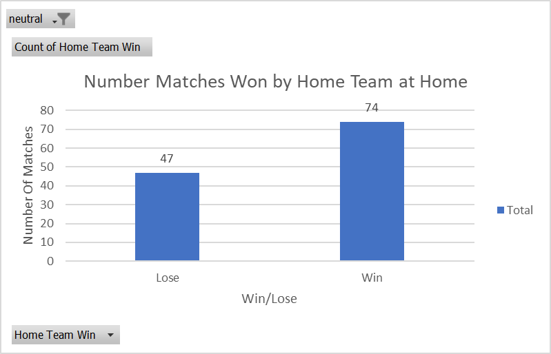
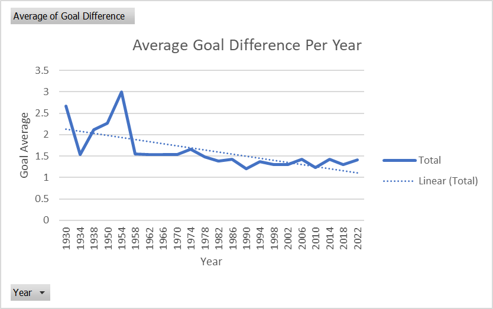

# fifa-world-cup-data-analysis

# ⚽ FIFA World Cup Data Analysis

## 📊 Project Overview

This project explores over a century of FIFA World Cup history to answer three key questions:

1. Do teams have a home advantage?
2. What are the trends in goal differences over time?
3. Which countries have faced each other most frequently?

The analysis was conducted using Excel with a focus on data cleaning, statistical testing, and visualization. Insights derived from this data help reveal patterns in competitive balance, match outcomes, and historic rivalries.

---

## 🎯 Objectives

- Investigate the existence of a **home advantage** in World Cup matches.
- Analyze how **goal differences** have evolved over time.
- Identify the **most frequent country matchups** in World Cup history.

---

## 🗂 Dataset

- **Source**: [Kaggle - International Football Results (1872–2023)](https://www.kaggle.com/datasets/aissaouihamda/international-football-matches-1872-present)
- Filtered to include **only FIFA World Cup** matches.

---

## 🛠 Tools & Techniques

- **Excel**: Pivot Tables, AVERAGE, COUNTIFS, IF, ABS, NORM.S.INV
- **Statistical Testing**: One-tailed Z-test for proportions
- **Visualizations**: Line charts with trendlines, conditional formatting, bar charts

---

## 🔍 Analysis & Methodology

### 1. 📈 Home Advantage

- Analyzed win rates of host nations.
- Conducted a **Z-test**:
  - Win Rate: `74/121 ≈ 61.16%`
  - Z-statistic: `2.46` vs. Critical Value: `1.64`
- ✅ **Conclusion**: Statistically significant home advantage exists.

---

### 2. 📉 Goal Difference Trends

- Extracted year from match dates to analyze tournament-level trends.
- Calculated average **goal difference per tournament** using Pivot Table.
- Used a **line chart with a trendline** to visualize changes over time.

- 🧠 Insight: Goal differences have decreased over time, suggesting greater parity between teams, especially after tournament expansions.

---

### 3. 🤝 Frequent Matchups

- Created a pivot matrix of Home vs. Away teams.
- Used **conditional formatting** to highlight frequent pairings.
- Most common rivalries:
  - Germany vs. Yugoslavia
  - Brazil vs. Sweden
  - Brazil vs. Mexico
  - Netherlands vs. Argentina

---

## 📌 Key Findings

- **Home teams** win significantly more often.
- **Goal differences** have decreased, implying stronger global competition.
- **Certain countries** have developed long-standing World Cup rivalries.

---

## 🚀 Next Steps

- Integrate additional data (e.g. weather, player stats, knockout rounds).
- Build a Power BI or Tableau dashboard.
- Expand project using Python or SQL for scalability and automation.

---

## 📁 Project Structure

- fifa-world-cup-data-analysis/
- data/ # Raw and filtered datasets
- analysis/ # Excel workbook with analysis
- visuals/ # Screenshots and charts
- docs/ # Optional report or supporting files
- README.md # This file

